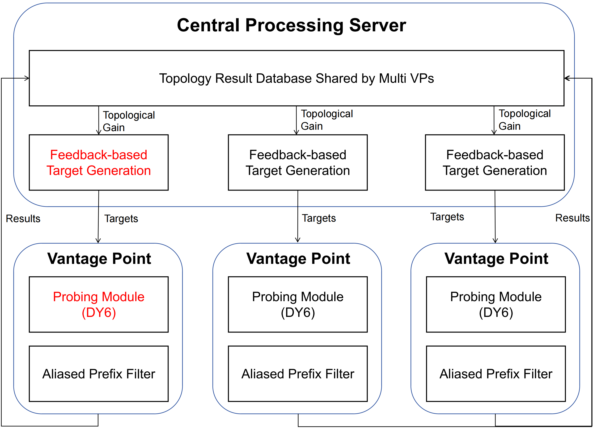

# TopoHunter: A Multi Vantage Point Collaborative System for Efficient Internet-wide IPv6 Topology Discovery

TopoHunter is a novel multiple vantage point collaborative topology discovery system. The central concept of TopoHunter is to allocate more probing resources to target spaces that yield greater topological benefits, as well as to their surrounding areas. To achieve this, we design a feedback-based target generation module comprised of a target space value forest that maintains the estimated probing value of hierarchical target spaces. This approach efficiently addresses the inefficiencies of existing probing methods by reducing redundancy and maximizing topological gains from each vantage point. Our system has successfully discovered the most extensive and complete IPv6 topology map to date, comprising over 100 million router interfaces and 160 million edges, covering 74.17% of autonomous systems and 46.50% of routing prefixes announced by the BGP system.

### Installation & Usage

see in topo-client/readme.md & topo-server/readme.md.
